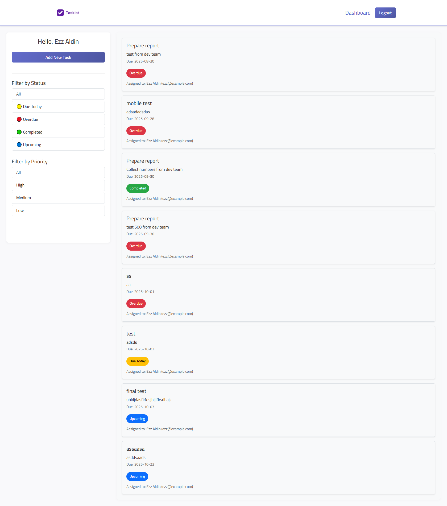
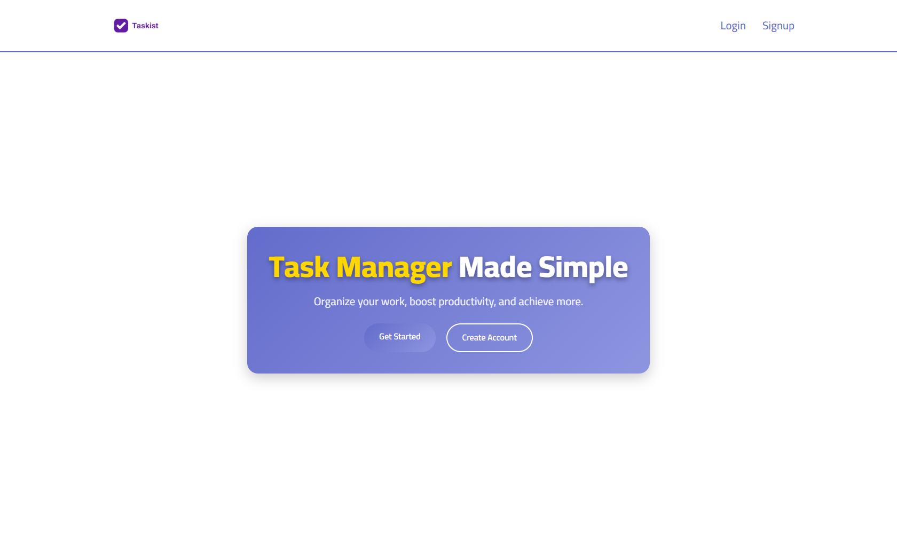
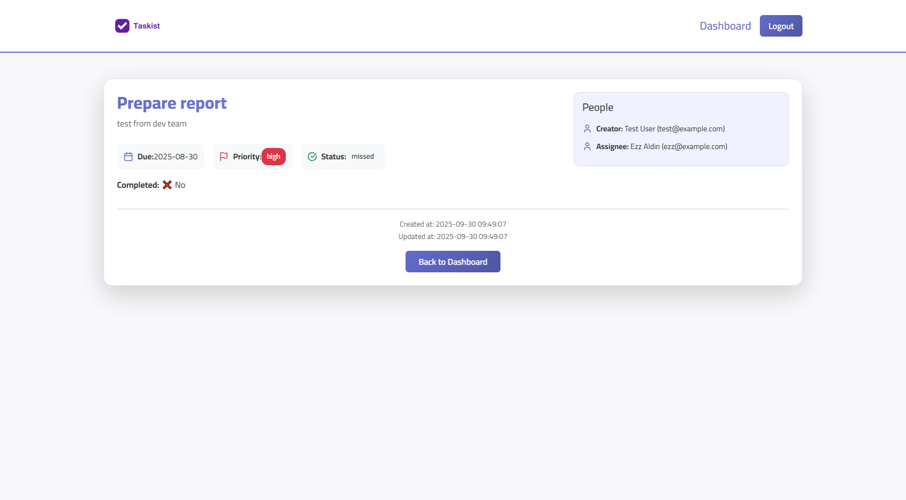

# 📌 Task Manager Frontend (React)

<p align="center">
  
</p>

---

## 🚀 About the Project

This is the **React Frontend** for the [Task Manager API](https://github.com/YourBackendRepoLink).  
It provides a clean and responsive user interface for managing tasks.

### ✨ Features

- 🔐 Authentication (Login / Signup)
- 📋 View and filter tasks by **status** and **priority**
- ➕ Add new tasks with due date, priority, and assignee
- 🔎 View detailed task information (creator, assignee, due date, etc.)
- 📱 Fully responsive design with off-canvas menu for mobile

---

## 📷 Screenshots

| Welcome Page                                                                  | Dashboard                                                                  | Task Details                                                             |
| ----------------------------------------------------------------------------- | -------------------------------------------------------------------------- | ------------------------------------------------------------------------ |
|  |  |  |

---

## 🛠️ Installation

1. Clone the repository:
   ```bash
   git clone https://github.com/EzzzzAldin/task-manager-React.git
   cd task-manager-frontend
   ```
